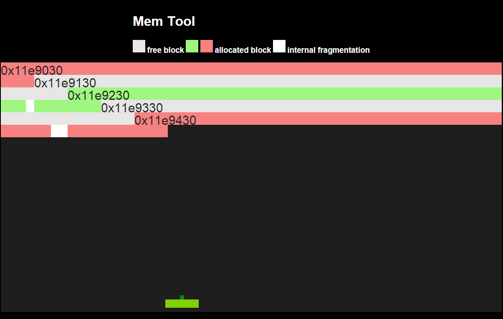

# Memory Visualization Tool  
## Overview  
This project visualizes memory allocation in a creative way. Provided an output.txt file, which contains the information of a memory snapshot. The format of the snapshot is defined in the [section](#snapshot-format) below  

## How to run  
Save the snapshot in a text file, name it "output.txt" under the same directory as index.html. Create a static server to serve those files. It python2.7 is installed, this could be simply done by 

    python -m SimpleHTTPServer

Open browser, navigate to index.html and you will see the visualization. Left click to start playing around with it. 
## Snapshot format  
The snapshot is generated by a memory management tool I made for CSE 320 class. The format of the snapshot is as followed:  

    <Type> <MemRowSize> <TotalHeapSize>
    # Date-Time
    MemAddress BlockSize [RequestedSize]
    ...

*Type* can be "Explicit", "Implicit" or "Full"  
"Explicit" means the output is Explicit free-list  
"Implicit" means the output is Implicit free-list  
"Full" means the output is a Full list  

Each row below Date-Time is a memory block. If there are three arguments in one line, the block is a allocated block. It there are only two arguments, the block is a free block.   
## Example snapshot  
#### Explicit free-list  

    Explicit 16 2304
    # 11/2/12 - 8:02PM
    0x11e9430 256
    0x11e9130 256
    0x11e9730 128
    0x11e9330 256
    0x11e9030 256
    0x11e9630 256

>note: Explicit free-list only contains information of the free blocks. Blocks may not be in address order.

#### Full list  

    Full 16 2304
    # 11/2/12 - 8:02PM
    0x11e9030 256 256
    0x11e9130 256
    0x11e9230 256 236
    0x11e9330 256
    0x11e9430 256 216

#### Implicit free-list  

    Implicit 16 2304
    # 11/2/12 - 8:02PM
    0x11e9030 256 256
    0x11e9130 256 
    0x11e9230 256 236
    0x11e9330 256
    0x11e9430 256 216

>note: Since Implicit free-list contain the information of allocated block, the snapshot of it is essentially the same as the Full list, except the type difference.

## Screen shot  
